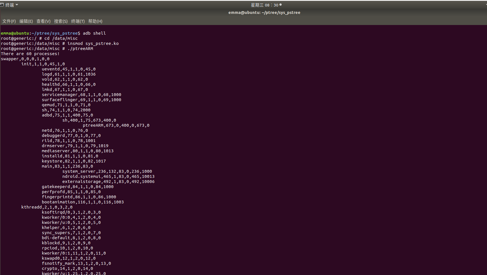
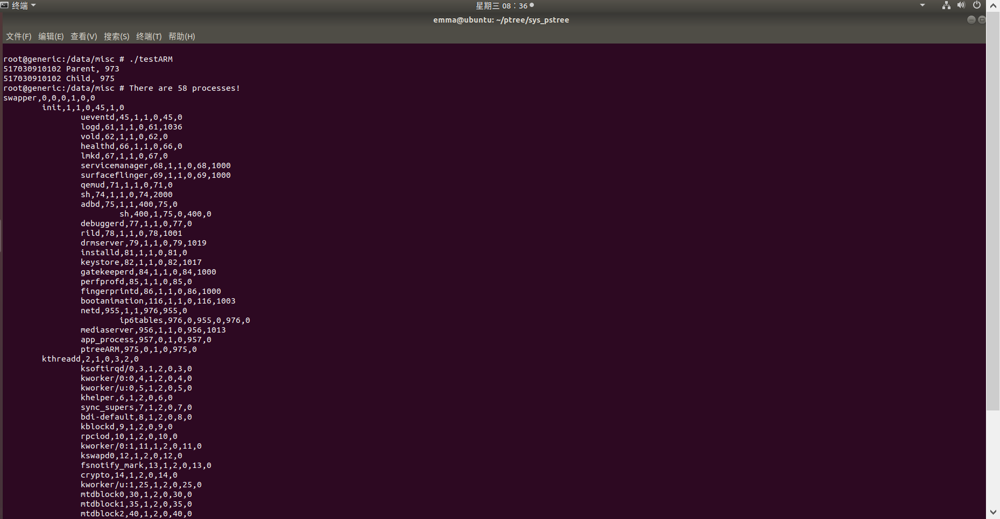
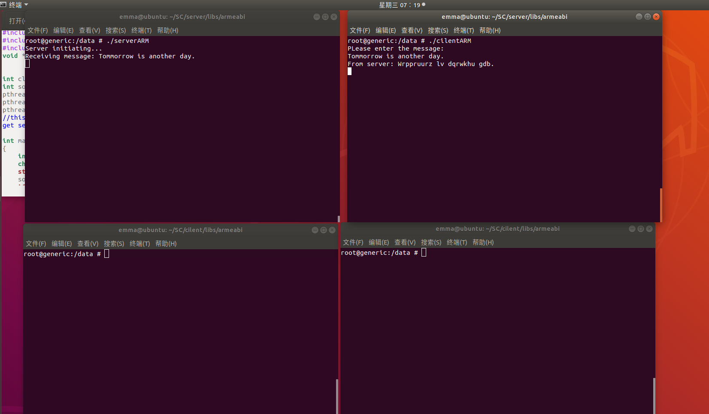
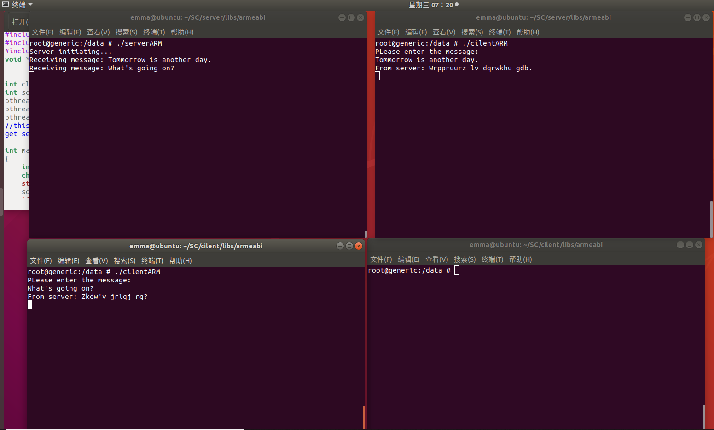
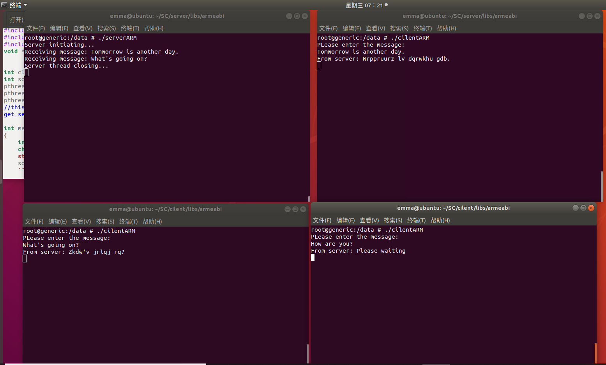
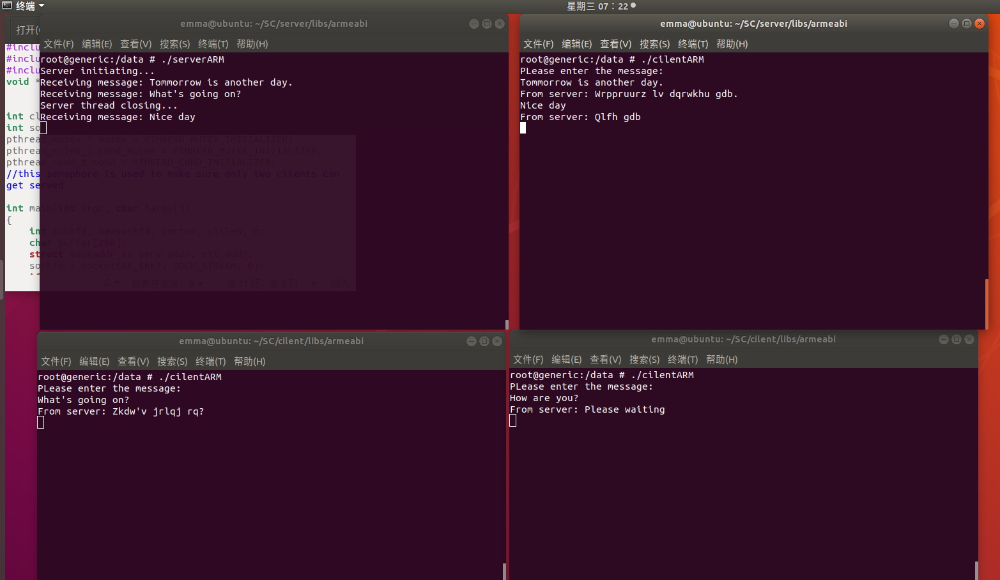
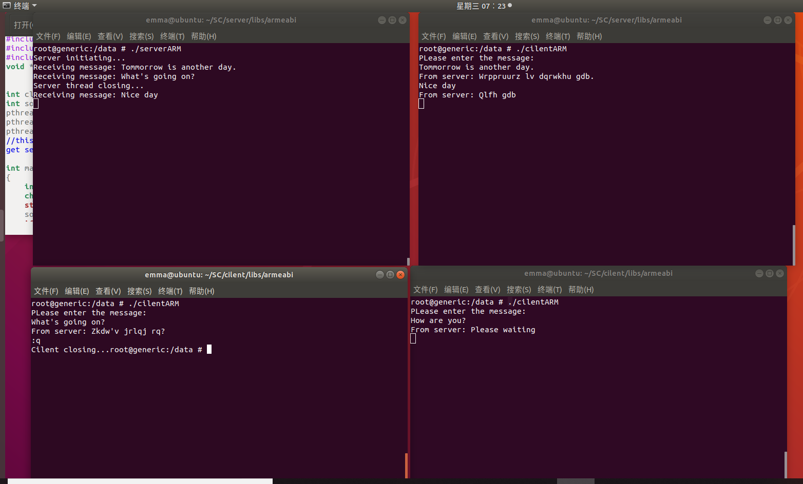
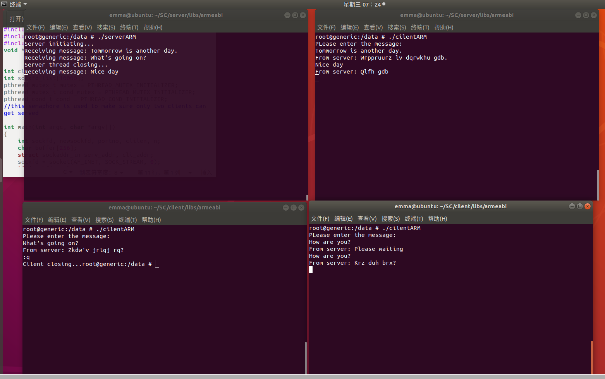
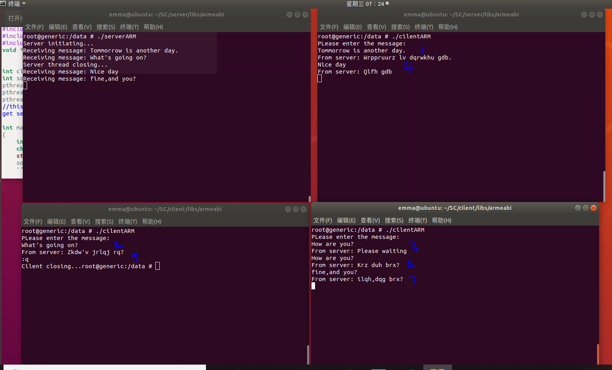

# CS307-Project-1-Android-Process-Tree
SJTU CS307 Operating Systems Project 1:  Android Process Tree
# CS307 Operating Systems Project 1:  Android Process Tree


## 1. Files Descriptions 

### 1.1 Problem One

- ***Makefile***
  make file for pstree Module.

- ***sys\_pstree.c***
  Module for pstree system call.

  - structure `prinfo`
    A simplified structure to describe a process, include its name, state, user ID, process ID, and process ID of its parent, children, sibling.

  - Function `transTaskToPrinfo()`

    Linux maintains a list of all processes in a doubly linked list. Each entry in this list is a `task_struct` structure. We need to transfer `task_struct` to our `prinfo` structure.

  - Function `bfs()`

    Write the process tree into buffer in *DFS* order.

  - Function `sys_pstree()`

    Use copies of two argument and call function `bfs`.

  - Function `addsyscall_init()`

    replace old system call with new one.

  - Function `addsyscall_exit()`

    replace new system call with old one.

### 1.2 Problem Two

- ***Android.mk***
  Make file for ptree.c

- ***textscript.txt***

  A result of Problem 2.

- ***ptree.c***
  To print pstree

  - structure `prinfo`
    omitted.
  - Function `printPrinfo()`
    Print the process tree from the DFS order buffer. Use tabs to indent children with respect to their parents.
  - `main()`
    make a copy of arguments, call pstree system call, and then print buffer.

### 1.3 Problem Three

- ***Android.mk***
      make file for test.c

- ***textscript.txt***
      A result of Problem 3.

- ***test.c***

  Generate a new process and output “StudentID Parent” with PID, then generates its children process output “StudentID Child” with PID. Use `execl()` to execute ptree in the child process.

### 1.4 Problem Four

- **Server**

  - *Android.mk*

    make file for server.c

  - server.c

    Server receives message from client, encrypts it and sends it back. After receiving a message from a new client, server creates a new thread to deal with it.  If there are more than two processes, the function `serve()` will block the later process and continue to receive, encrypt and send back the message from process unblocked.

- **Client**

  - Android.mk

    make file for client.c

  - client.c

    Client just sends input massage and receives massage from server until user inputs ":q".

- ***textscript.txt***

  A result of Problem 4.

  

## 2. Process Descriptions

### 2.1 Set up

- Install JDK and modify environment variables

- Install SDK and set up AVD as required

- Install necessary lib

  ```
  sudo apt-get install libc6:i386 libgcc1:i386 gcc-4.6-base:i386 libstdc++5:i386 libstdc++6:i386
  ```

   Change `gcc-4.6-base:i386` to `gcc-4.8-base:i386`

- Set up NDK and modify environment variables

- Build HelloWord project and module

  - It's quite strange that `emulator –avdYourAvdName–kernel KernelLocation –show-kernel ` doesn't work for me.  I search on the Internet and finally find that `emulator64-arm –avdYourAvdName–kernel KernelLocation –show-kernel ` works.
  - I need to change `CROSS_COMPILE` in makefile from relative path to absolute path.


### 2.2 Problem One

#### 2.2.1 Analysis

Write a pstree system call in Android.
We need to transfer the `task_struct` in Linux to a simplified structure `prinfo`, and then use DFS to store the process tree in an array called `buffer`.

#### 2.2.2 Modification

​    Here just lists some main modification in my program and other parts are omitted.

- **Function *transTaskToPrinfo***

  The function transfer `task_struct` to our simplified `prinfo` structure. Some elements are easy to find, but `first_child_pid` and `next_sibling_pid` need special attention. The doubly linked list has empty head node which children point to and last child will point to it's parent( exactly speaking, parent's children part). In fact, it's a cycle.

  ```c#
  void transTaskToPrinfo(struct task_struct *task, struct prinfo *prin)
  {
      prin->parent_pid = task->parent->pid;
      prin->pid = task->pid;
      prin->state = task->state;
      get_task_comm(prin->comm, task);  //process name
      prin->uid = task->cred->uid;      //user id
  	prin->first_child_pid = (list_empty(&(task->children)))? 0:
  	list_entry((&task->children)->next,struct task_struct,sibling)->pid;
  	//children is list head, so the next element is the actual first child
  
  	if (list_empty(&(task->sibling)))
      	prin->next_sibling_pid = 0;
  	else{
      	pid_t sibling_pid = list_entry(&task->sibling,
      	struct task_struct,sibling)->pid;
      	//sibling is list entry
      	prin->next_sibling_pid = (sibling_pid == prin->parent_pid)?
      	0:sibling_pid;
  	} //if there isn't a sibling, sibling.next point to parent or it's empty
  }
  ```


- **Function DFS**

  Simply use DFS. Pay attention to `list_for_each()` whose definition is written in comment.

  ```c#
  void dfs(struct task_struct *task, struct prinfo *buf, int *nr)
  {
      struct task_struct *tmp;
      struct list_head *lst;
  	transTaskToPrinfo(task,&buf[*nr]);
  	*nr = *nr + 1;
      
  	//define list_for_each(pos, head)
  	//for (pos = (head)->next; pos != (head); pos = pos->next)
  	list_for_each(lst, &task->children){
      	tmp = list_entry(lst, struct task_struct, sibling);
      	dfs(tmp, buf, nr);
  	}
  }
  ```

- **Function *sys\_pstree***

  The key is to create template variable for `buffer` and `nr` and then copy back to them, as well as using `read_lock()` to avoid sleep.

  ```c#
  int sys_pstree(struct prinfo *buf, int *nr)
  {
      struct prinfo *buf_t;
      int *nr_t;
      buf_t = kmalloc_array(1000, sizeof(*buf), GFP_KERNEL);
      nr_t = kmalloc(sizeof(int), GFP_KERNEL);
  	if (buf_t == NULL || nr_t == NULL) {
      	printk("Allocation initialize failed!\n");
      	return -EFAULT;
  	}
  
  	*nr_t = 0;
  	//dfs
  	read_lock(&tasklist_lock);  //avoid sleep
      	dfs(&init_task, buf_t, nr_t);
  	read_unlock(&tasklist_lock);
  
  	// copy to user
  	if (copy_to_user(buf, buf_t, 1000 * sizeof(*buf_t))) {
      	printk("Copy_to_user failed!\n");
      	return -EFAULT;
  	}
  	if (copy_to_user(nr, nr_t, sizeof(int))) {
      	printk("Copy_to_user failed!\n");
   	    return -EFAULT;
  	}
      
  	kfree(buf_t);
  	kfree(nr_t);
  	return *nr;
  }
  ```


### 2.3 Problem Two

#### 2.3.1 Analysis

We need to print the DFS order process tree returned by pstress system call and use tabs to indent children with respect to their parents.  We can use function `printTree()`  to do all of this and the main function just call pstree system call and  `printTree()` . The detailed description of `printTree()` lies in the next part.

#### 2.3.2 Modification

Since we use `buffer` to store the DFS order process tree, the key is to calculate how many tabs are there before we print the information of process. For `buf[i]` and `buf[i-1]`, there may exist two relationship--`buf[i-1]` is parent of `buf[i]` or `buf[i]` is a sibling of `buf[i-1]`'s ancestor. We can distinguish them by `parent_pid`. If `buf[i-1]` is parent of `buf[i]`, we add a tab. If `buf[i-1]`  is a sibling of `buf[i-1]`'s ancestor, we subtract tabs until they are at the same level. 

```c#
void printTree(struct prinfo *buf, int *nr)
{
    int pid_pos[1000] = {0};  //the position of pid
    int tab_num = 0;    //the number of tab

    printf("%s,%d,%ld,%d,%d,%d,%ld\n", buf[0].comm, buf[0].pid, 
        buf[0].state,buf[0].parent_pid, buf[0].first_child_pid, 
        buf[0].next_sibling_pid, buf[0].uid);

    int i=1;
    while(i < *nr)
    {
        //calculate number of tab
        if(buf[i].parent_pid == buf[i-1].pid) 
        //buf[i-1] is parent of buf[i], forward
            tab_num++;
        else if (buf[i].parent_pid != buf[i-1].parent_pid) 
        //buf[i] is a sibling of buf[i-1]'s ancestor, backward
        {
            int tmp = buf[i-1].parent_pid;
            tab_num--;
            while(buf[i].parent_pid!=buf[pid_pos[tmp]].parent_pid)
            {
                tmp = buf[pid_pos[tmp]].parent_pid; //find parent
                tab_num--;
            }
        }
        //record the position of pid
        pid_pos[buf[i].pid] = i;
        //print tab
        int j = 0;
        while(j < tab_num)
        {
            printf("\t");
            j++;
        }
        //print process information
        printf("%s,%d,%ld,%d,%d,%d,%ld\n", buf[i].comm, buf[i].pid,
            buf[i].state,buf[i].parent_pid, buf[i].first_child_pid,
            buf[i].next_sibling_pid, buf[i].uid);
        i++;
    }
}
```


### 2.4 Problem Three

#### 2.4.1 Analysis

We need to use ` fork()` to create a child process. Given that `fork()` returns the process ID of child in parent process and it returns 0 in child, we can use this to distinguish child and parent process, and then we can do different things in different processes.

#### 2.4.2 Modification

- The program use `fork()` to create a child process, print `pid ` of both processes, and use `execl()` to execute program `ptreeARM` in child program.
- I put all the files in `/data/misc` folder in AVD, so the path parameter in function `execl()` is `/data/misc/ptreeARM`.

```C#
int main(int argc, char *argv[])
{
	pid_t child_pid = fork();	 	
	if (child_pid < 0)
		printf("Error!");
	else if (child_pid == 0)
    {	//child process
		printf("517030910102 Child, %d\n", getpid());	
		execl("/data/misc/ptreeARM", "ptreeARM", NULL);	// execute ptree
	}
	else
		printf("517030910102 Parent, %d\n", getpid());	// parent process
	return 0;
}
```


### 2.5 Problem Four

#### 2.5.1 Analysis

- Server receives message from client, encrypts it and sends it back. 
  - After receiving a message from a new client, server creates a new thread to deal with it. 
  - Use `cliNum` to record the number of client and use `pthread_mutex_lock()`  and  `pthread_mutex_lock()` to guarantee synchronization.
  - If there are more than two processes, the function `serve()` will use `pthread_cond_wait()` to block the later process and continue to receive, encrypt and send back the message from process unblocked.
  - After receiving ":q" from a unblocked client, server will end the thread and signal a waiting client.
- Client just sends massage user input and receives massage from server until user inputs ":q".

#### 2.5.2 Modification

Here just lists main modification. 

- **Server**

  - add some global variables

    ```c#
    int cliNum = 0;   //the number of cilents
    int sockfd_list[10000];   // store the sockfd from cilents
    pthread_mutex_t mutex = PTHREAD_MUTEX_INITIALIZER;  //mutex for counting
    pthread_mutex_t cond_mutex = PTHREAD_MUTEX_INITIALIZER; 
    //mutex for remaining two cilent
    pthread_cond_t cond = PTHREAD_COND_INITIALIZER;  
    // condition for making sure only two clients can get served
    ```

  - Modification in main function

    ```c#
    	//Concurrent multi-thread service
        int k = 0;
        while(1)  //receive different cilents
        {
            newsockfd = accept(sockfd, (struct sockaddr *) &cli_addr, &clilen);
            if (newsockfd < 0)
                printf("ERROR on accept\n");
            sockfd_list[k] = newsockfd; 
                
            pthread_t thread;
            n = pthread_create( &thread, NULL, serve, (void*)&sockfd_list[k]);
            if(n){
                printf("Error - pthread_create() return code: %d\n",n);
                exit(EXIT_FAILURE);
            }
            k++;
        }
    ```

  - Modification in `server()` function

    ```c#
    void *serve(void *sockfd)
    {
        int newsockfd = (int)(*((int*)sockfd));
        int n, i;
        char buffer[256];
    
        bzero(buffer,256);   //clear buffer
        n = read(newsockfd,buffer,255);
        if (n < 0) 
            printf("ERROR reading from socket\n");
    
        pthread_mutex_lock(&mutex);
            cliNum++;
        pthread_mutex_unlock(&mutex);
        
        pthread_mutex_lock(&cond_mutex);  // make sure only two clients get served
        if (cliNum>=3)
        {
            if (cliNum == 3)
                printf("Server thread closing...\n");
            n = write(newsockfd,"Please waiting",14);
            if (n < 0) printf("ERROR writing to socket");
            pthread_cond_wait(&cond, &cond_mutex); 
            bzero(buffer,256);
            n = read(newsockfd,buffer,255); 
        }
        else 
            printf("Receiving message: %s \n",buffer);
        pthread_mutex_unlock(&cond_mutex);
    
    
        while(1)  //receive different message from same cilent
        {
            for(i = 0; i < strlen(buffer); i++)    // encrytion
                if('a' <= buffer[i] && buffer[i] <= 'z')
                    buffer[i] = 'a' + (buffer[i] - 'a' + 29) % 26;
                else if('A' <= buffer[i] && buffer[i] <= 'Z')
                    buffer[i] = 'A' + (buffer[i] - 'A' + 29) % 26;
        
            n = write(newsockfd,buffer,strlen(buffer)); 
            if (n < 0) printf("ERROR writing to socket");
            bzero(buffer,256);
            n = read(newsockfd,buffer,255);
            if (n < 0) printf("ERROR reading from socket\n");
            if (strcmp(buffer,":q"))   // ":q" to quit
                printf("Receiving message: %s \n",buffer);
            else
                break;
        } 
    
        pthread_mutex_lock(&mutex);
            cliNum--;
        pthread_mutex_unlock(&mutex);
        pthread_cond_signal(&cond);  //signal a waiting thread when one finishs 
        pthread_exit(0);
    }
    ```

  

- **Client**

  ```c#
  	gets(buffer);
      while(strcmp(buffer,":q"))  //":q" to quit
      {
          n = write(sockfd,buffer,strlen(buffer));
          if (n < 0) 
              printf("ERROR reading from socket\n");
          bzero(buffer,256);
          n = read(sockfd,buffer,255);
          if (n < 0) 
              printf("ERROR reading from socket\n");
          printf("From server: %s\n",buffer);
          bzero(buffer,256);
          gets(buffer);
      }
      
      n = write(sockfd,buffer,strlen(buffer));  //send ":q" to server
      if (n < 0) 
          printf("ERROR reading from socket\n");
      printf("Cilent closing...");
  ```

  

## 3. Result

### 3.1 Problem One

No result can be shown in this part


### 3.2 Problem Two

Here just shows a screenshot with part of result. The whole result can be found in the *textscript.txt* of problem two.




### 3.3 Problem Three

Here just shows a screenshot with part of result. The whole result can be found in the *textscript.txt* of problem three.




### 3.4 Problem Four

Here these screenshots show all the steps of this execution. The final result can also be found in the *textscript.txt* of problem four.
















